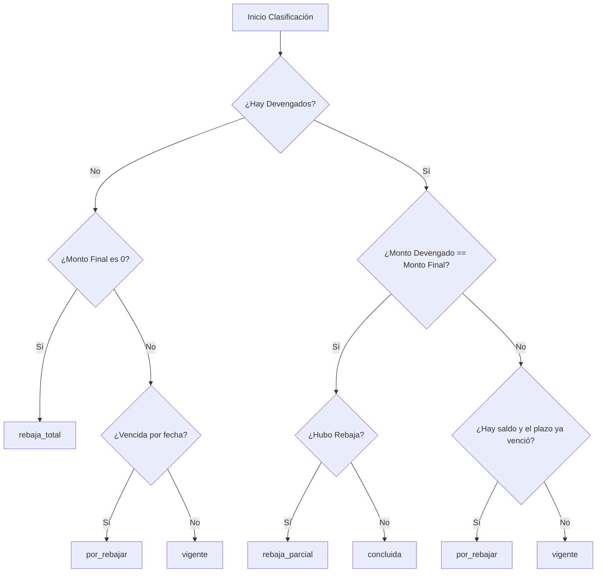

# DevengadosSiafWeb

Sistema Inteligente de Extracción, Conciliación y Clasificación de Órdenes de Servicio del SIAF (MEF - Perú)

Este proyecto desarrolla un flujo continuo de ingeniería y análisis de datos diseñado para automatizar la extracción de registros financieros gubernamentales y, mediante algoritmos heurísticos y de puntuación, deducir la salud operativa y presupuestal de las órdenes de servicio del Estado peruano.

El sistema demuestra la capacidad de resolver dos problemas críticos en la gestión de datos públicos:
1. La automatización de la extracción de APIs protegidas mediante simulación dinámica de sesiones de usuario.
2. El análisis y modelado de datos para conciliar impuestos/retenciones e inferir estados financieros que no están explícitos en los sistemas de origen.

---

## Capacidades de Automatización (Ingeniería de Datos)

La fase de extracción resuelve la complejidad de interactuar con la API interna del Sistema Integrado de Administración Financiera (SIAF).

### Gestión de Sesión Híbrida y Persistencia
Para evitar la necesidad de almacenar credenciales de usuario en texto plano o interactuar constantemente de forma manual, se implementó un mecanismo híbrido con Playwright:
* **Autenticación Asistida**: Si el token de sesión expira o no existe, el script levanta una instancia controlada del navegador Chromium para permitir la autenticación multifactor o ingreso de credenciales del usuario directamente en el portal oficial.
* **Persistencia del Estado de Navegación**: El script exporta las cookies y el almacenamiento local (`localStorage`) en un archivo serializado de estado. Las consultas subsecuentes se realizan de forma automatizada (headless) cargando este estado almacenado hasta que expire.
* **Inyección de Consultas en Contexto de Navegador**: En lugar de emular llamadas HTTP desprotegidas que podrían ser bloqueadas por políticas de CORS o firewalls, las consultas HTTP se realizan inyectando código asíncrono (`fetch`) dentro del contexto autenticado del navegador.

---

## Motor de Análisis de Datos e Inferencias Financieras

La API del SIAF entrega datos crudos por fase (compromisos, devengados, giros) de forma lineal y fragmentada. El script de análisis consolida esta información e implementa un motor de toma de decisiones estructurado en tres componentes lógicos:

### 1. Algoritmo de Conciliación y Agrupación de Retenciones
En las órdenes de servicio del Estado (especialmente en locación de servicios), los pagos se dividen comúnmente en un monto neto (recibo por honorarios) y un monto retenido (por ejemplo, el 8% de impuesto a la renta de cuarta categoría). En la base de datos del SIAF, estos aparecen como registros de devengados individuales.

El algoritmo agrupa de forma secuencial y temporal los devengados netos con sus respectivas retenciones para calcular el **Monto Bruto Real** devengado por mes o hito, resolviendo discrepancias que duplicarían falsamente el conteo de entregas o pagos mensuales.

### 2. Sistema de Puntuación para Inferencia del Monto Mensual (Modulación)
Las órdenes de servicio no especifican formalmente el valor del pago mensual en sus metadatos. El analizador evalúa las posibles modularidades del contrato mediante un sistema de scoring multivariable para deducir el cobro mensual esperado:

| Heurística Aplicada | Puntaje Base | Racional de Negocio |
| :--- | :---: | :--- |
| **Monto Más Repetido** | 100 + Frecuencia | En contratos de largo plazo, el pago neto mensual es constante y repetitivo en el tiempo. |
| **División Exacta del Compromiso Original** | 92 | El importe total adjudicado suele ser un múltiplo exacto de la mensualidad (ej. 30,000 en 6 meses = 5,000/mes). |
| **División Exacta del Compromiso Modificado** | 86 | Si hubo una rebaja de presupuesto, el monto final resultante suele mantener la proporcionalidad del saldo restante. |
| **Primer Pago Detectado en Glosa** | 82 | Búsqueda textual mediante expresiones regulares en la descripción del documento para identificar hitos de inicio. |
| **Primer Devengado ante Rebaja** | 68 | En contratos rescindidos, el primer pago suele representar el valor íntegro pactado antes del cese. |
| **Monto Máximo sin Repetición** | 60 | En contratos con pocos movimientos, asume el pago individual más alto para evitar tomar pagos parciales como mensualidades estándar. |

> [!NOTE]
> El algoritmo penaliza automáticamente a los candidatos a mensualidad que coincidan con descripciones de "pago acumulado" o "dos meses juntos", garantizando la precisión del modelo frente a irregularidades administrativas.

### 3. Modelo de Estimación Temporal (Duración e Inferencia de Vigencia)
Al deducir el monto mensual, el sistema calcula la duración teórica prevista del contrato (Monto Comprometido / Monto Mensual Inferido) y evalúa los meses transcurridos desde la fecha del compromiso hasta la fecha de corte:
* **Vigencia Probable**: El contrato aún se encuentra dentro del periodo de ejecución estimado.
* **Vencida Probable / Por Antigüedad**: El plazo estimado de ejecución ha concluido, pero el sistema aún registra un saldo pendiente no devengado. Esto indica una anomalía administrativa (posible necesidad de una rebaja o liberación de saldo).

---

## Clasificación del Estado Operativo de la Orden

El analizador utiliza un árbol de decisión robusto para clasificar el estado de las órdenes en 5 categorías de negocio cerradas, proporcionando una acción sugerida para el equipo de finanzas o abastecimiento:

### Detalle de Estados y Acciones Administrativas

#### Concluida
* **Condición**: El total devengado acumulado coincide exactamente con el monto final comprometido y el saldo financiero es cero.
* **Acción sugerida**: Archivar expediente; orden de servicio cerrada satisfactoriamente.

#### Rebaja Parcial
* **Condición**: Hubo modificaciones negativas al presupuesto del compromiso original, y los devengados cuadran exactamente con dicho monto reducido.
* **Acción sugerida**: Registrar como orden ejecutada con saldo final conciliado.

#### Rebaja Total
* **Condición**: Las modificaciones negativas igualan el 100% del monto comprometido original. La orden fue cancelada antes de generar devengados.
* **Acción sugerida**: Confirmar anulación en el sistema patrimonial.

#### Por Rebajar
* **Condición**: La fecha estimada de vigencia del servicio ha vencido y el expediente mantiene un saldo presupuestal remanente sin devengar.
* **Acción sugerida**: Solicitar de inmediato al área usuaria la liberación (rebaja de saldo) del presupuesto no ejecutado para reasignar recursos.

#### Vigente
* **Condición**: El expediente cuenta con saldo financiero a favor y la estimación del periodo contractual indica que el servicio aún se encuentra en plazo de ejecución.
* **Acción sugerida**: Monitorear entregables de los siguientes meses.

---

## Estructura del Reporte de Salida

El script genera un libro Excel (`analisis_siaf_definitivo.xlsx`) optimizado para la auditoría de datos, estructurado en dos hojas:

### Hoja 1: Resumen de Expedientes
Consolida métricas agregadas por expediente:
* Datos de identificación (Proveedor, RUC, Expediente).
* Auditoría de montos (Monto original, modificaciones, monto final estimado, saldo).
* Métricas inferidas (Monto mensual inferido, método de inferencia utilizado y nivel de confianza de la estimación).
* Métricas temporales (Meses previstos, meses ejecutados, meses pendientes de devengar, vigencia temporal).
* Diagnóstico operativo (Categoría asignada y la acción sugerida detallada).

### Hoja 2: Grupos de Devengado
Detalla la traza de auditoría de los devengados agrupados por el algoritmo de conciliación de retenciones. Permite verificar de forma transparente qué recibos por honorarios fueron emparejados con qué impuestos retenidos para consolidar el monto bruto mensual.
